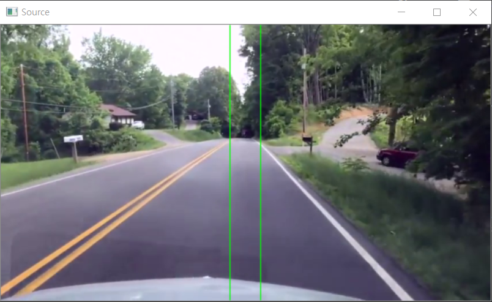
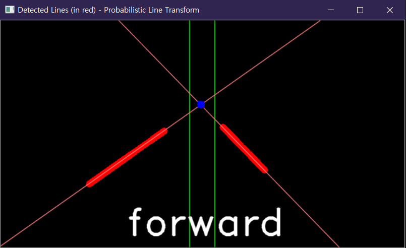
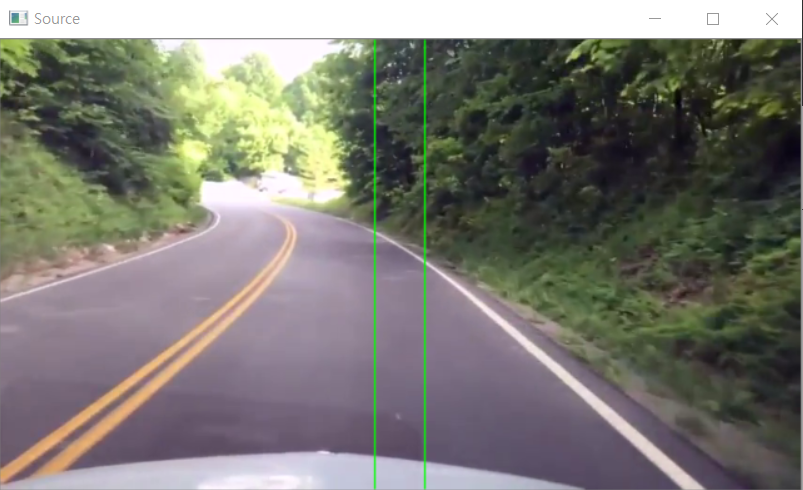
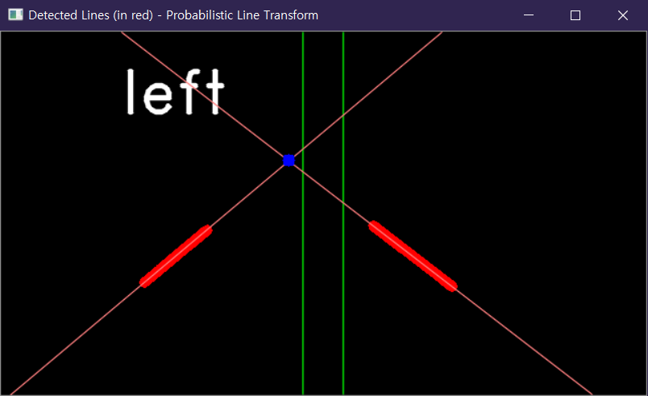
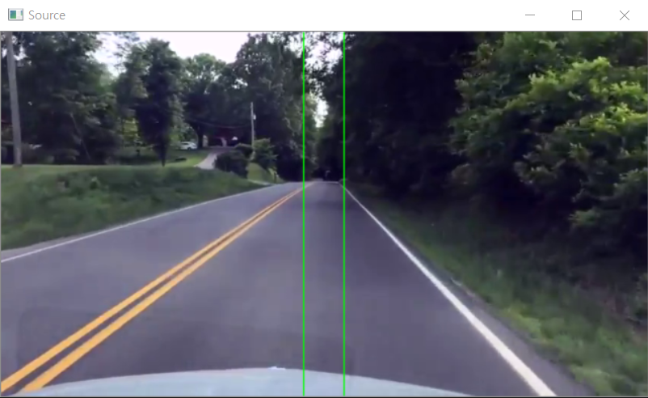
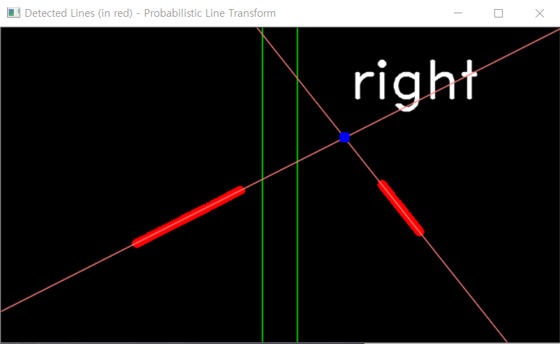

# lane_detect
**라즈베리파이에 연결된 카메라 모듈로부터 real-time 도로 주행 image를 받아 openCV를 활용하여 차선을 탐지한다.**

**탐지된 차선의 연장선을 그리고, 그 교점의 위치를 기반으로 모터를 동작시켜 진행방향을 조절한다.**

    anaconda-python with openCV

## [Source code](https://github.com/20170375/lane_detect/blob/main/code_comment.md)

## Output examples
     

     

     

## Reference
+ [openCV로 차선인식하기[허프변환]](https://diy-project.tistory.com/115)
