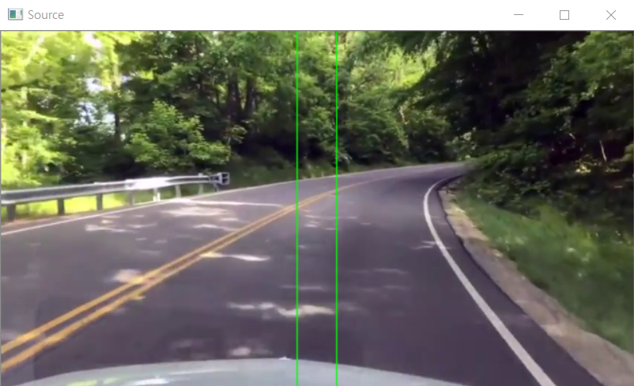

# lane_detect
**라즈베리파이에 연결된 카메라 모듈로부터 real-time 도로 주행 image를 받아 openCV를 활용하여 차선을 탐지한다.**

**탐지된 차선의 연장선을 그리고, 그 교점의 위치를 기반으로 모터를 동작시켜 진행방향을 조절한다.**

    anaconda-python with openCV

## Code comment

+ [**lane_detect.py**](https://github.com/20170375/lane_detect/blob/main/lane_detect.py)

    **openCV를 import하여 카메라장치 혹은 샘플동영상으로부터 영상을 받는다**

    **640x360(pixel) 으로 resize하고, 사다리꼴 모양 mask를 적용시켜 차선을 탐지할 범위를 좁힌다.**

    **cv2.HoughLinesP() 함수를 사용하여 탐지된 선분들의 집합에서 각도가 20°이상 160°이하인 선분을 찾아,**

    + **20°≤ θ ≤ 90° : right 차선**

    + **90°≤ θ ≤ 160° : left 차선**

    **으로 구분하고 각각의 선분들의 시점과 종점을 기준으로 average 선분(left, right 각각)을 만든다.**

    **이 average 선분들을 연장시켜 두 직선을 만들어 교점을 구하고 그 교점(crossX, crossY)의 위치에 따라 진행방향을 결정한다.**

    **만일 어느 한쪽 차선이 인식이 안된 경우에는, 인식된 차선의 반대방향으로 진행방향을 선택한다.**

    ex) left 차선만 인식된 경우: right 선택
    
    ↳ right 차선이 너무 멀거나, 급커브 구간에서 right 차선의 곡률이 커서 인식이 안되었다고 판단.

+ [**test_module.py**](https://github.com/20170375/lane_detect/blob/main/test_module.py)

    **라즈베리파이 모터 동작 함수들을 구현한 모듈**

    **RPi.GPIO를 import하여 setting(), move(), stop(), cleanup() 함수 구현**

## Output examples
     

     

     

## Reference
+ [openCV로 차선인식하기[허프변환]](https://diy-project.tistory.com/115)
+ [openCV 비디오 입력 출력](https://copycoding.tistory.com/154)
